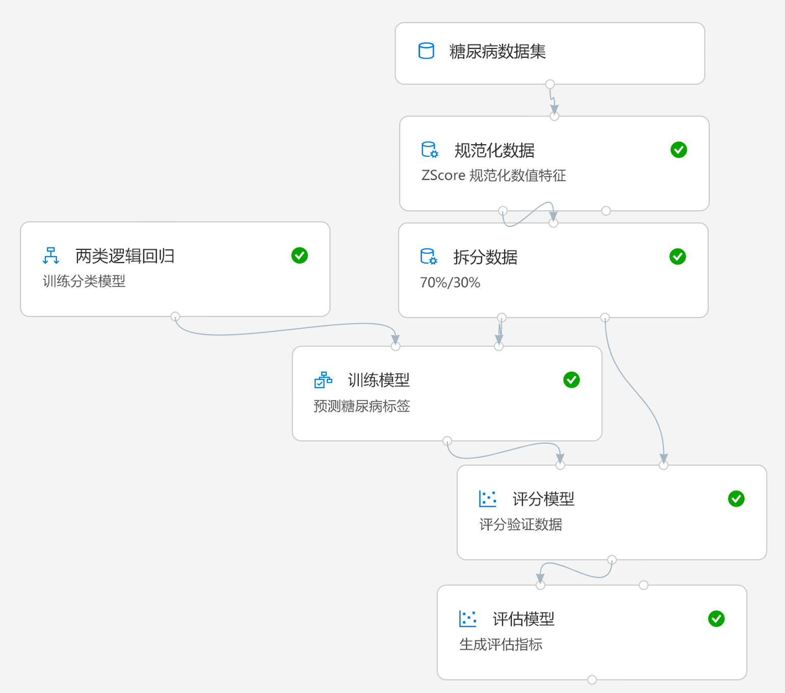

# 实验 2A：使用 Azure ML 设计器创建训练管道

*设计器*界面提供了拖放环境，你可以在其中定义工作流或数据引入的*管道*、转换以及模型训练模块，以创建机器学习模型。然后，可以将该管道以 Web 服务的形式发布，以便客户端应用程序用*于推理*（根据新数据生成预测）。

> **注意**：撰写本文时，Azure 机器学习设计器处于*预览*阶段。你可能会遇到一些意外错误。

## 开始前

在开始本实验之前，请确保你已完成[实验 1A](Lab01A.md) 和[实验 1B](Lab01B.md)，其中包括创建 Azure 机器学习工作区和本实验中使用的其他资源的任务。

然后在工作区的 [Azure 机器学习工作室](https://ml.azure.com)中，在**“计算”**页面上的**“训练群集”**选项卡上，打开审慎创建的**“aml-cluster”**计算目标，然后单击**“编辑”**。然后将**“最小节点数”**设置设置为**“1”**，并单击**“更新”**。这将减少管道在实验中运行所花费的时间。

## 任务 1：创建设计器管道并浏览数据

要开始使用设计器，首先必须创建管道并添加要使用的数据集。

1. 在工作区的 [Azure 机器学习工作室](https://ml.azure.com)中，查看**“设计器”**页面并创建新管道。
2. 在“设置”窗格中，将默认管道名称 (**Pipeline-Created-on-*date***) 更改为**“视觉对象糖尿病训练”**（如果**“设置”**窗格不可见，请单击顶部管道名称旁边的**“&#9881;”**图标）。
3. 请注意，需要指定要在其上运行管道的计算目标。在**“设置”**窗格中，单击**“选择计算目标”**，然后选择在上一个实验中创建的**“aml-cluster”**计算目标。
4. 在设计器的左侧，展开**“数据集”**部分，然后将在上一个练习中创建的**“糖尿病数据集”**数据集拖动到画布上。
5. 选择画布上的**“糖尿病数据集”**模块，并查看其设置。然后在**“输出”**选项卡上，单击**“可视化”**图标（外观像柱形图）。
6. 查看数据的架构，注意你可以看到各个列的分布显示为直方图。然后关闭可视化效果。

## 任务 2：添加转换

在训练模型之前，通常需要对数据进行一些预处理转换。

1. 在左侧窗格中，展开**“数据转换”**部分，其中包含各种模块，可用于在模型训练之前对数据进行转换和预处理。将**“规范化数据”**模块拖到**“糖尿病数据集”**模块下方的画布上。然后将**“糖尿病数据集”**模块的输出连接到**“规范化数据”**模块的输入。
2. 选择**“规范化数据”**模块并查看其设置，注意它要求指定转换方法和要转换的列。然后，将转换保留为**“ZScore”**，编辑各列，使其包含以下列名称：
    * PlasmaGlucose
    * DiastolicBloodPressure
    * TricepsThickness
    * SerumInsulin
    * BMI
    * DiabetesPedigree

    **注意**：我们将对数值列进行规范化，使其具有相同的量级，并避免具有较大值的列主导模型训练。通常要进行很多次这样的预处理转换来准备用于训练的数据，但是在本练习中，我们一切从简。

3. 现在，我们可以将数据拆分到多个单独的数据集中，以进行训练和验证。在左侧窗格中，在**“数据转换”**部分，将**“拆分数据”**模块拖到**“规范化数据”**模块下方的画布上。然后将**“规范化数据”**模块的**“转换的数据集”**（左侧）输出连接到**“拆分数据”**模块的输入。
4. 选择**“拆分数据”**模块，并将其设置配置如下：
    * **拆分模式**：拆分行
    * **第一个输出数据集中的行的占比**：0.7
    * **随机种子**：123
    * **分层拆分**：False

## 任务 3：添加模型训练模块

准备好数据并将其拆分为训练数据集和验证数据集后，即可配置管道来训练和评估模型。

1. 在左侧窗格中展开**“模型训练”**部分，然后将**“训练模型”**模块拖到**“拆分数据”**模块下方的画布上。然后，将**“拆分数据”**模块的**“结果数据集 1”**（左侧）输出连接到**“训练模型”**模块的**“数据集”**（右侧）输入。
2. 我们正在训练的模型将预测**“糖尿病”**值，因此选择**“训练模型”**模块并修改其设置，将**“标签列”**设置为**“Diabetic”**（匹配大小写并准确拼写！）
3. 该模型将预测的**“Diabetic”**标签是一个二元列（对于有糖尿病的患者，值为 1；对于没有糖尿病的患者，值为 0），因此我们需要使用*分类*算法来训练模型。展开**“机器学习算法”**部分，然后在**“分类”**下，将**“二元逻辑回归”**模块拖到**“拆分数据”**模块左侧、**“训练模型”**模块上方的画布上。然后将此模块输出连接到**“训练模型”**模块的**“未训练模型”**（左侧）输入。
4. 为了测试经过训练的模型，我们需要使用它来对拆分原始数据时保留的验证数据集进行评分。展开**“模型评分和评估”**部分，并将**“对模型进行评分”**模块拖到**“训练模型”**模块下方的画布上。然后将**“训练模型”**模块的输出连接到**“对模型进行评分”**模块的**“已训练模型”**（左侧）输入，并将**“拆分数据”**模块的**“结果数据集 2”**（右侧）输出拖到**“对模型进行评分”**模块的**“数据集”**（右侧）输入。
5. 为了评估模型的性能，我们需要查看对验证数据集进行评分时生成的一些指标。从**“模型评分和评估”**部分，将**“评估模型”**模块拖到**“对模型进行评分”**模块下的画布上，然后将**“对模型进行评分”**模块的输出连接到**“评估模型”**模块的**“对数据集进行评分”**（左侧）输入。

## 任务 4：  运行训练管道

定义数据流步骤后，现可以行训练管道并训练模型。

1. 验证管道外观是否与以下类似（请注意，图像在每个模块中都包含注释，用于记录该模块的功能 - 将设计器用于实际项目时，这样做不失为一个好主意！）：

    

2. 点击右上角的**“运行”**。然后在系统出现提示时，创建一个名为 **visual-training** *的新*试验，并运行该试验。  这将初始化计算目标，然后运行管道，运行过程可能需要 10 分钟或更长的时间才能完成。可以在设计画布的右上方看到管道运行的状态。

    **提示**：在运行过程中，可以在**“管道”**页面查看已创建的管道，在**“试验”**页面查看已创建的试验。完成后，切换回**“设计器”**页面上的**“视觉对象糖尿病训练”**管道。

3. **“标准化数据”**模块完成后（由 &#x2705; 图标表示），选择它，然后在**“设置”**窗格中的**“输出 + 日志”**选项卡上，在**“转换数据集”**部分的**“端口输出”**下，单击**“可视化”**图标，并注意你可以查看转换列的统计信息和分布可视化效果。
4. 关闭**“规范化数据”**可视化效果，关闭设置窗格或调整其大小（单击“X”或 **&#8599;&#8601;** 图标），然后等待其余模块完成。然后可视化**“评估模型”**模块的输出，以查看模型的性能指标。

    **注意**：此模型的性能不是很好，部分原因是我们仅执行了最少的功能工程和预处理。可以尝试其他分类算法并比较结果（可以将**“拆分数据”**模块的输出连接到多个**“训练模型”**和**“对模型进行评分”**模块，还可以将第二个评分模型连接到**“评估模型”**模块以便并行比较）。练习的目的只是为了向你介绍设计器界面，而不是训练完美的模型！
