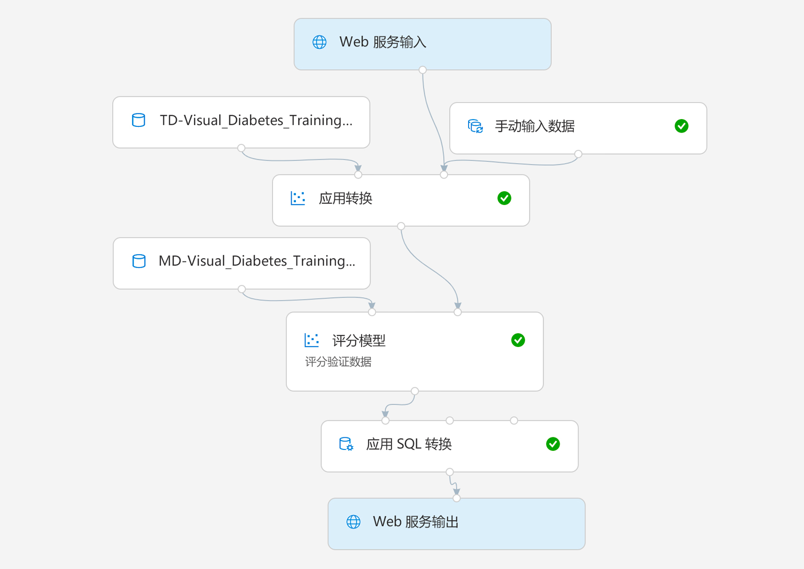

# 实验 2B：使用 Azure ML 设计器部署服务

拥有了经过训练的模型，即可采用训练管道并用它创建推理管道，以对新数据进行评分。

> **注意**：撰写本文时，Azure 机器学习设计器处于*预览*阶段。你可能会遇到一些意外错误。

## 开始前

在开始本实验之前，请确保你已完成[实验 1A](Lab01A.md) 和[实验 1B](Lab01B.md)，其中包括创建 Azure 机器学习工作区和本实验中使用的其他资源的任务。还必须完成[实验 2A](Lab02A.md)，其中包括创建本实验中使用的设计器训练管道的任务。

## 任务 1：准备推理计算

在本实验中，你将在 Azure Kubernetes 服务 (AKS) 群集上以容器化服务的方式发布推理管道。AKS 群集初始化可能需要花费一些时间，因此请在准备推理管道之前开始该过程。

1. 在 [Azure 机器学习工作室](https://ml.azure.com)中，在工作区的 **“计算”** 页面上，查看每个选项卡下的现有计算目标。其中应包括：
    * **计算实例**：你在上一个实验中创建的计算实例。
    * **训练群集**：你在上一个实验中创建的 **aml-cluster** 计算目标。
    * **推理群集**：无（暂时！）
    * **附加计算**：无（可以在此处附加存在于工作区外部的虚拟机或 Databricks 群集）

2. 在 **“计算实例”** 选项卡中，如果计算实例尚未运行，请启动该实例，你稍后将在本实验使用它。

3. 在 **“推理群集”** 选项卡中，添加具有以下设置的新群集：
    * **计算名称**：aks-cluster
    * **Kubernetes 服务**：新建
    * **区域**：*任何可用区域*
    * **虚拟机大小**：Standard_DS2_v2（*使用筛选器器在列表中找到它*）
    * **群集用途**：开发-测试
    * **节点数**：3 个
    * **网络配置**：基本
    * **启用 SSL 配置**：未选择

4. 验证计算目标是否处于 *“正在创建”* 状态，然后继续执行下一个任务。定期返回并刷新此页面，验证是否正在创建群集。

    > **注意**：创建 AKS 群集可能要花费大量时间。如果在创建过程中发生错误，请删除发生故障的群集，然后使用其他区域重试。

## 任务 2：创建推理管道

在预配推理计算时，你可以准备推理管道以进行部署。

1. 在 **“设计器”** 页面上，打开你在上一个实验中创建的 **“视觉对象糖尿病训练”** 管道。
2. 在 **“创建推理管道”** 下拉列表中，单击 **“实时推理管道”**。几秒钟后，将打开新版本的管道，名为 **“视觉对象糖尿病训练-实时推理”**。
3. 将新管道重命名为 **“预测糖尿病”**，然后检查新管道。请注意，一些转换和训练步骤已封装在此管道中，以便使用来自训练数据的统计信息来规范化任何新的数据值，并使用经过训练的模型对新数据进行评分。
4. 推理管道假设新数据将与原始训练数据的架构匹配，因此将训练管道中的 **“糖尿病数据集”** 模块包括在内。但是，此输入数据包括模型预测的 **“Diabetic”** 标签，位于尚未进行糖尿病预测的新患者数据而言，这样并不直观。删除此模块，并从 **“数据输入和输出”** 部分中将其替换为 **“手动输入数据”** 模块，该模块连接到与 **“Web 服务输入”** 相同的 **“应用转换”** 模块的 **“数据集”** 输入。然后，修改 **“手动输入数据”** 模块的设置以使用以下 CSV 输入，其中包括对三位新患者观察得出的不带标签的特征值：

    ```CSV
    PatientID,Pregnancies,PlasmaGlucose,DiastolicBloodPressure,TricepsThickness,SerumInsulin,BMI,DiabetesPedigree,Age
    1882185,9,104,51,7,24,27.36983156,1.350472047,43
    1662484,6,73,61,35,24,18.74367404,1.074147566,75
    1228510,4,115,50,29,243,34.69215364,0.741159926,59
    ```

5. 推理管道包括 **“评估模型”**模块，此模块在根据新数据进行预测时无用，因此请删除此模块。
6. **“对模型进行评分”** 模块的输出包括所有输入功能以及预测标签和概率得分。要将输出限制为仅预测和概率，请删除 **“对模型进行评分”** 模块和 **“Web 服务输出”** 之间的连接，在 **“Python 语言”** 部分添加一个 **“执行 Python 脚本”** 模块，将 **“对模型进行评分”** 模块的输出连接到 **“执行 Python 脚本”** 的 **“数据集 1”** （最左边）输入，然后将 **“执行 Python 脚本”** 模块的输出连接到 **“Web 服务输出”**。然后，修改 **“执行 Python 脚本”** 模块的设置，以使用以下代码（替换所有现有代码）：

    ```Python
    import pandas as pd

    def azureml_main(dataframe1 = None, dataframe2 = None):

        scored_results = dataframe1[['PatientID', 'Scored Labels', 'Scored Probabilities']]
        scored_results.rename(columns={'Scored Labels':'DiabetesPrediction',
                                       'Scored Probabilities':'Probability'},
                              inplace=True)
        return scored_results


    ```

7. 验证管道外观是否与以下类似：

    

8. 在用于训练的 **aml-compute** 计算目标上，将管道作为名为 **“预测糖尿病”** 的新试验运行。这可能需要一点时间。

## 任务 3：发布 Web 服务

现在有了用于实时推理的推理管道，可以将其发布为 Web 服务，以供客户端应用程序使用。

1. 返回 **“计算”** 页面，然后在 **“推理计算”** 选项卡上，刷新视图并验证是否已创建 **aks-cluster** 计算。如果还没有，请等待推理群集创建完毕。这可能需要很长时间。
2. 切换回 **“设计器”** 选项卡，然后重新打开 **“预测糖尿病”推理管道**。如果尚未完成运行，请等待其完成。然后可视化 **“执行 Python 脚本”** 模块的输出，以查看输入数据中三个患者观察值的预测标签和概率。
3. 在右上角，单击 **“部署”**，然后在创建的 **aks-cluster** 计算目标上设置一个名为 **predict-diabetes** 的新的实时终结点。
4. 等待 Web 服务部署完成，这可能需要几分钟时间。部署状态显示在设计器界面的左上方。

    > **提示**：在等待服务部署时，何不花点时间访问 [https://docs.microsoft.com/azure/machine-learning/service/concept-designer](https://docs.microsoft.com/azure/machine-learning/service/concept-designer) 以查看 Azure 机器学习设计器文档？

## 任务 4：测试 Web 服务

现在，可以从客户端应用程序测试已部署的服务，在本例中，使用 Notebook VM 中的笔记本。

1. 在 **“终结点”** 页面上，打开 **predict-diabetes** 实时终结点。
2. **predict-diabetes** 终结点打开时，在 **“使用”** 选项卡上，记下 **“REST 终结点”** 和 **“主键”** 值。
3. 在另一个浏览器选项卡中，为 Azure 机器学习工作室中的工作区打开 **“计算”** 页面。如果计算实例尚未运行，请等待其启动。然后单击其 **Jupyter** 链接。
4. 在 Jupyter 中，在 **“Users/DP100”** 文件夹中，打开 **“02B - Using the Visual Designer.ipynb”**。
5. 在笔记本中，将 **ENDPOINT** 和 **PRIMARY_KEY** 占位符替换为服务的值（可从终结点页面上的 **“使用”** 选项卡复制这些值）。
6. 运行代码单元并查看 Web 服务返回的输出。
7. 笔记本中的代码运行完毕后，在 **“文件”** 菜单上单击 **“关闭并停止”** 以关闭它及其 Python 内核。然后关闭所有 Jupyter 浏览器选项卡。

## 任务 5：删除 Web 服务并停止计算

此 Web 服务托管在 Kubernetes 群集中。如果不打算对其进行进一步试验，则应删除终结点和群集，以避免产生不必要的 Azure 费用。还应停止其他计算资源，除非需要再次使用它们。

1. 在 [Azure 机器学习工作室](https://ml.azure.com)中的 **“终结点”** 选项卡上，选择 **“predict-diabetes”** 终结点。然后单击 **“删除”** (&#128465;) 按钮并确认删除该终结点。
2. 在 **“计算”** 页面上的 **“推理群集”** 选项卡上，选择 **“aks-cluster”** 终结点。然后单击 **“删除”** (&#128465;) 按钮并确认要删除计算目标。
3. 在 **“计算”** 页面上的 **“训练群集”** 选项卡上，打开 **“aml-cluster”** 计算目标，并单击 **“编辑”**。然后将 **“最小节点数”** 设置设置为 **“0”**，并单击 **“更新”**。
4. 在 **“计算”** 页面上的 **“计算实例”** 选项卡上，选择计算实例，然后单击 **“停止”** 以将其关闭。
